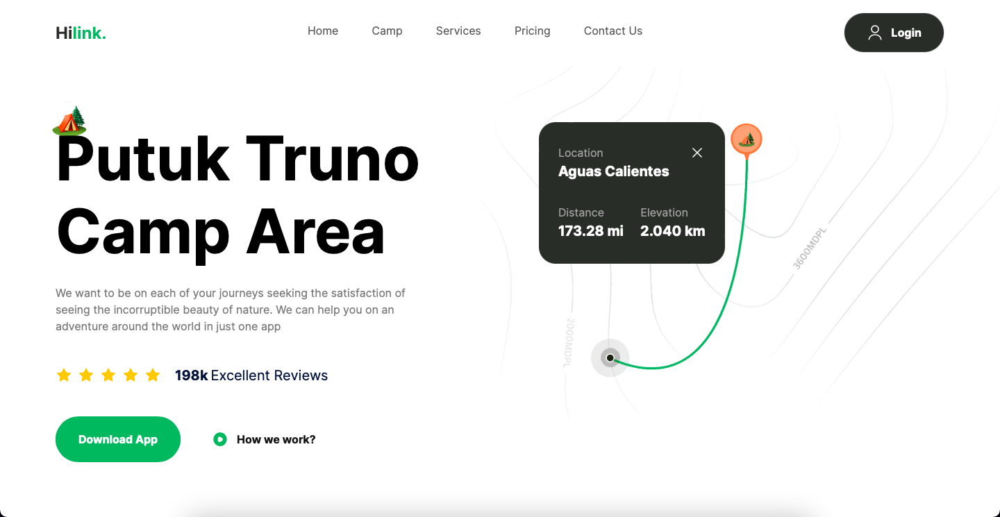

<div align="center">
  
  
  
  
  <br />
  <h2 align="center">Travel Website</h2>
  <div align="center">
     Develop a Travel ui/ux website, built with ReactJS and Tailwind CSS! 🌟 This marks my very first venture into React development, and I'm thrilled with the results.🌐💻
  </div>

  <a href="https://travel-anilkunda.netlify.app"><strong>➥ Live Demo</strong></a>
  
</div>

### Demo Screeshots



## 🔥 Some key features of this effort include:

- ✨ Experience smooth scrolling and subtle animations
- 💻 Compatibility across all devices - mobiles, tablets, and laptops
- 🎨 A beautiful and user-friendly interface

## 👨🏻‍💻 Technologies Used

<div align="left">
    <br>
</div>

## <a name="quick-start">🤸 Quick Start</a>

Follow these steps to set up the project locally on your machine.

**Prerequisites**

Make sure you have the following installed on your machine:

<div align="left">
     <br> 
</div>

**Cloning the Repository**

```bash
git clone https://github.com/anillkunda/travel_ui_ux.git
```

```bash
cd travel_ui_ux
```

**Installation**

Install the project dependencies using npm:

```bash
npm install
```

```bash
npm install aos
```

**Running the Project**

```bash
npm run dev
```

Open [http://localhost:5173](http://localhost:5173) in your browser to view the project.
